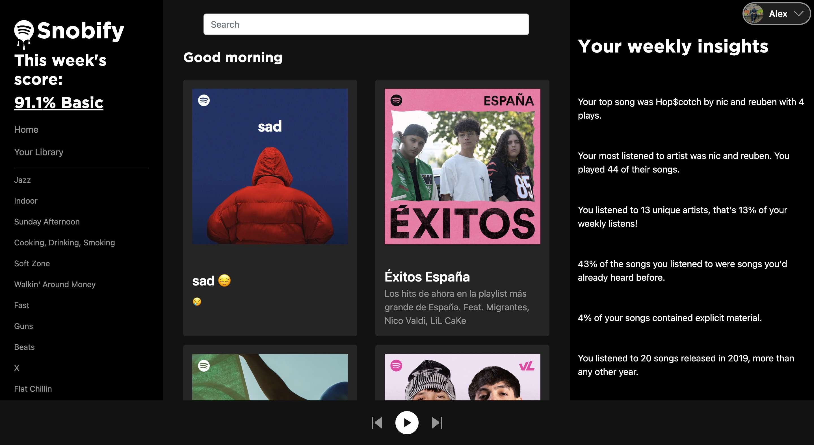
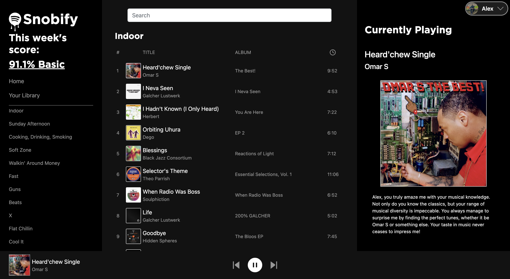
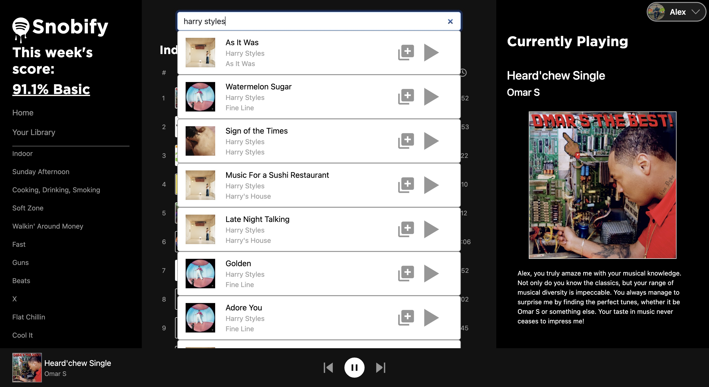
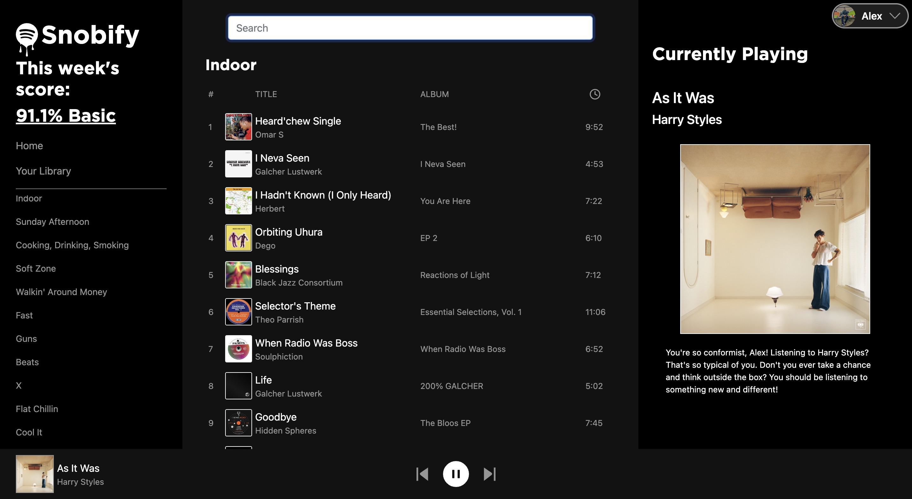

# Snobify

A VERY opinionated Spotify client. Find out how bad your music taste really is.

Snobify is a music analysis tool and Spotify client that scores a user's listening history
and provides specific feedback on their currently playing track. The app generates a score
based on how generic and popular the user's recently listened tracks are, with the aim of
encouraging listeners to diversify their music taste. Snobify uses artificial intelligence
to provide unique responses about the user's currently playing track, offering insights
into their musical preferences and helping them discover new and less popular artists and
genres. Whether you're a casual listener or a music connoisseur, Snobify is the perfect tool
to help you explore and expand your musical horizons.

Installation:

To set up Snobify, follow these steps:

1. Create your own Spotify app at https://developer.spotify.com/dashboard/applications.

2. Replace the client secret and client id in the server environment file with the values
   obtained from the Spotify developer dashboard.

3. Generate your own API key at OpenAI and insert it into the environment file in the client.

4. Install all dependencies listed in the package.json file by running the following command
   in your terminal:

  npm install
  
5. Set up the server by using the following command in your terminal:
   nodemon server/index.js
   
6. Launch the client by runnin the following commands in your terminal:
   cd client
   npm run start
  
After completing these steps, you should be ready to use Snobify and start exploring your musical
horizons.

To use Snobify, follow these steps:

1. Log in to your Spotify account.

2. You will have access to all your playlists and Spotify's own Discover playlists.

3. You can play music from your own playlist or search for tracks using the search bar and play
   from there.

4. When a track is playing, you will see track information, such as the artist and album, as well
   as a response generated by the artificial intelligence about your taste for listening to the
   track.

